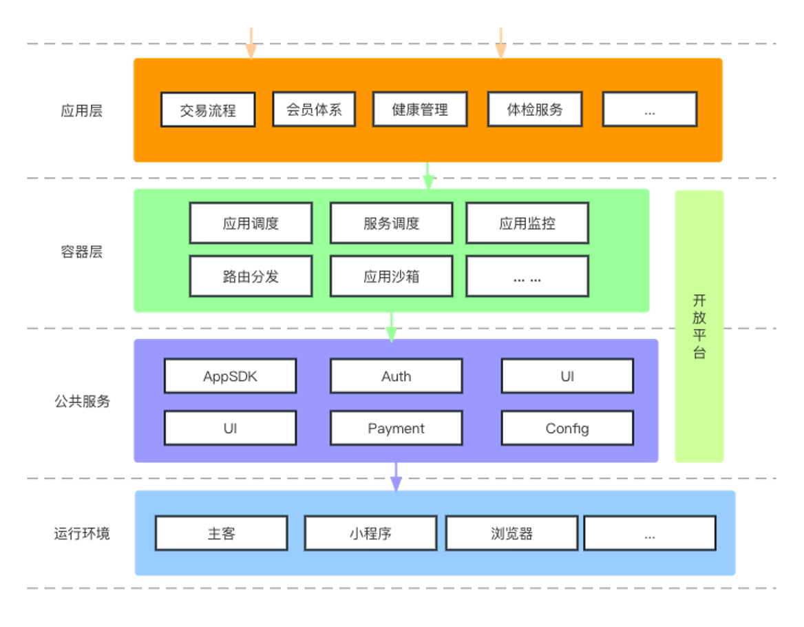
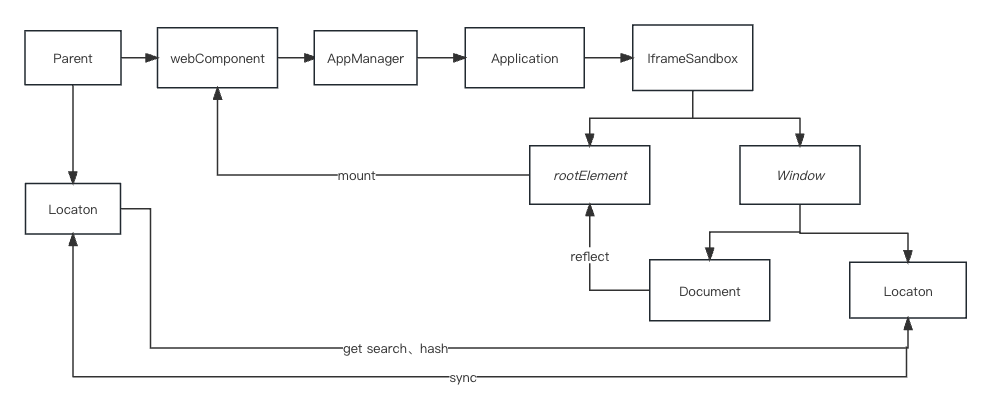
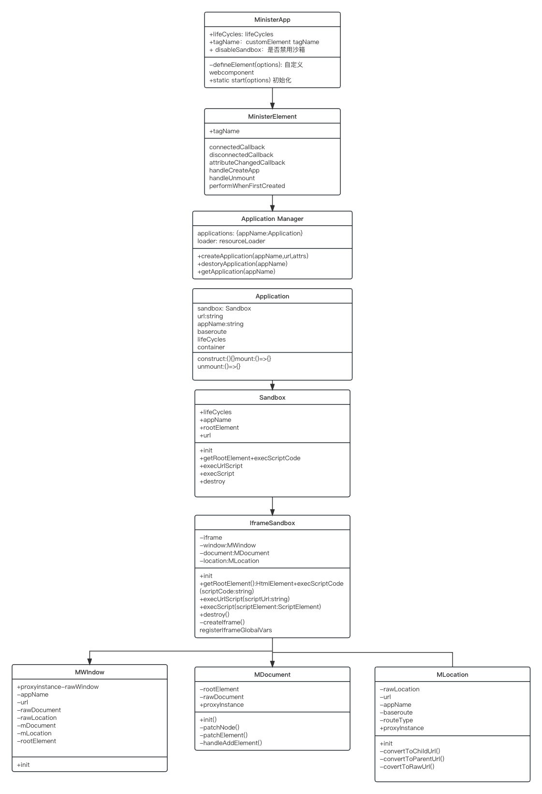

# Minister

# 背景介绍

1. 跨应用交互体验差
2. 同一基础功能重复接入（用户体验差）
3. 基础功能升级缓慢

# 架构设计



# 技术设计

## 模块关系图



## 模块设计图



# 项目目录

```yaml
.
├── demos 可视化测试用例
├── docs 文档站点
├── packages
│   ├── minister  // 入口、核心库
│   ├── react     // react 入口组件，解决无法识别customElement
│   ├── sandbox-iframe // 以iframe+proxy 为基础的沙盒
└── └── utils     // 公共方法
```

1. 整个项目基于是 pnpm worksapce + turbo 的 monorepo

# 开发

pnpm install

pnpm run start

## 分支管理

main： 主分支

dev_1.0.0 开发分支

# 测试

npm run test 单元测试

npm run e2e 自动化测试

# 部署（待完善）

基于github Action 

npm run build

npm run test

npm run e2e

npm publish